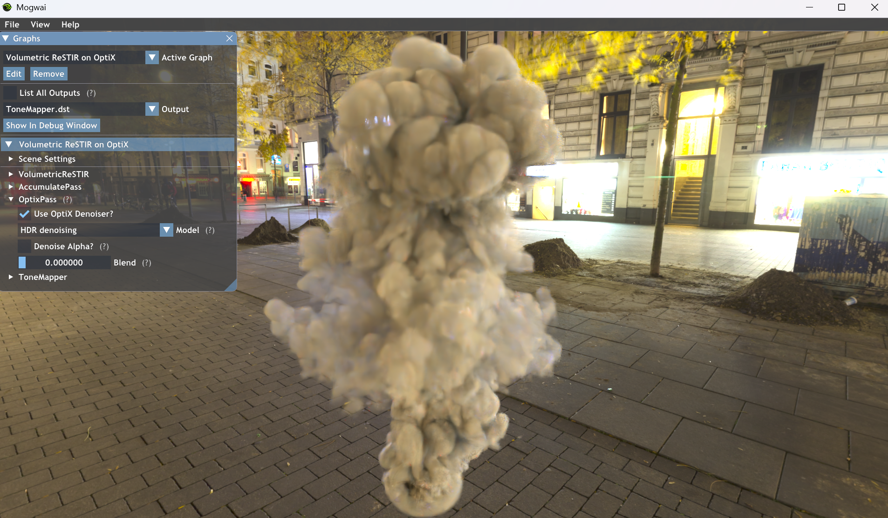

## Denoising vs Sampling Trade off for Volumetric ReSTIR

<p align="center">
  
</p>

This repository has been extended as part of an research project investigating the trade off between **denoising strength** and **additional Volumetric ReSTIR sampling** under a **fixed compute budget**.

The work builds based on the original implementation of **Volumetric ReSTIR** by Lin et al.(2021), and integrates Open Intel Image Denoise(OIDN) and updated version OptiX Denoiser 9.0 into the Falcor pipeline to enable systematic evaluation.

The original Volumetric ReSTIR implementation can be found at:  
https://github.com/DQLin/VolumetricReSTIRRelease

---

## Video

A video comparing Volumetric ReSTIR with different denoisers

https://github.com/user-attachments/assets/ae49a7f1-0505-46f3-b3a3-946a05ded240

## Motivation

Volumetric ReSTIR already produces low-variance samples by reusing light transport paths across space and time. In practice, however, real-time volumetric rendering pipelines often rely on denoising to further suppress noise.

This raises a key research question:

> Under a fixed frame-time budget, is it more effective to spend compute on stronger denoising, or to allocate that budget to improved Volumetric ReSTIR sampling?

To answer this, we extended the original codebase with multiple denoising configurations and performed controlled comparisons across different scenes and camera motions.

---

## What Was Added

### Denoiser Integrations

The following denoisers were integrated **on top of the VolumetricReSTIR render pass**:

- **Intel Open Image Denoise (OIDN) – GPU**
- **Intel Open Image Denoise (OIDN) – CPU**
- **NVIDIA OptiX AI Denoiser (Updated to OptiX 9.0 SDK)**
---

### Scene Configurations

Two canonical scenes were used, following the original Volumetric ReSTIR paper:

- **Simple Scene (Plume)**  
  A single volumetric plume illuminated by an environment map.  
  This setup isolates denoiser behavior in participating media without surface occlusions.

- **Complex Scene (Amazon Bistro)**  
  A geometrically dense environment populated with fog and over **20,000 emissive triangles**, introducing complex visibility, occlusion, and lighting interactions.

---

---

## Key Findings (Summary)

- Denoisers significantly reduce perceptual error, especially in complex scenes.
- In simple volumetric scenes, Volumetric ReSTIR already produces clean samples, making aggressive denoising less beneficial.
- Reallocating compute from denoising to sampling can recover much of the quality lost by weaker denoising.
- Low-quality denoising combined with improved sampling often matches and sometimes exceeds the quality of high-quality denoisers.
- Selecting the strongest denoiser is **not always optimal**; best results come from balancing sample quality and denoiser strength.

---

## OIDN (GPU) – Parameter Selection

The screenshot below shows the **OIDN GPU denoiser configuration** in Falcor, including the available quality presets and auxiliary input options, .etc.


---

## OptiX Denoiser – Parameter Selection

The screenshot below shows the **OptiX denoiser configuration** in Falcor, including blend factors and HDR/LDR mode, .etc.




## Scripts

All scripts used to reproduce the experiments presented in this repository can be found in the **`Scripts/`** directory located at the root.

## Prerequisites

- **Windows 10** version 1809 or newer  
- **Visual Studio 2019/2022**  
- **Microsoft Windows SDK** version 1903 (10.0.18362.1) or newer  
  https://developer.microsoft.com/en-us/windows/downloads/sdk-archive  
- **NVIDIA RTX 2060** or higher  

## How to Compile

1. Open `Falcor.sln`
2. Select the **ReleaseD3D12** configuration
3. Build the entire solution (If it crashes, try to build each RenderPass seperatly)

## Fetch Example Scenes

Download the example scenes (**7.87 GB**) from the following link:

https://drive.google.com/file/d/1oo29EuEN4TputF6JGTJYze_e08uDRbpx/view?usp=sharing

Extract the archive to **one** of the following locations:

- `Bin\x64\Release\Data`  
**OR**
- `Source\RenderPasses\VolumetricReSTIR\Data` (the data will automatically be copied to the appropriate binary folder whenever **VolumetricReSTIR** is built.)  

## To Use OptiX and OIDN Denoising

The denoisers require external SDKs. Below are the **expected dependency locations**.

### SDK Locations

All required dependencies must be available under:

- **CUDA**:  
  `Source\Externals\.packman\CUDA_13.0`

- **OptiX**:  
  `Source\Externals\.packman\OptiX_9.0.0`

- **Intel Open Image Denoise (OIDN)**:  
  `Source\Externals\.packman\oidn`

### Linking Installed SDKs

If the SDKs are installed elsewhere on your system, create junctions inside  
`Source\Externals\.packman` that point to your local installations.

The setup has been tested with:

- **CUDA 13.0**
- **OptiX SDK 9.0.0**
- **OIDN v2.3.3**

Run the following commands from the **repository root**:

```bat
cd Source\Externals\.packman

mklink /J CUDA_13.0   "[Your CUDA SDK installation directory]"
mklink /J OptiX_9.0.0 "[Your OptiX SDK installation directory]"
mklink /J oidn        "[Your OIDN installation directory]"
