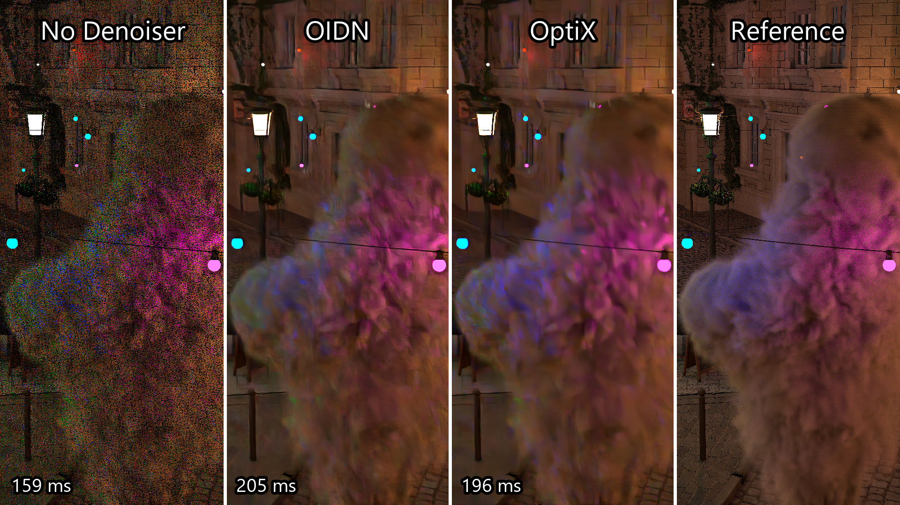
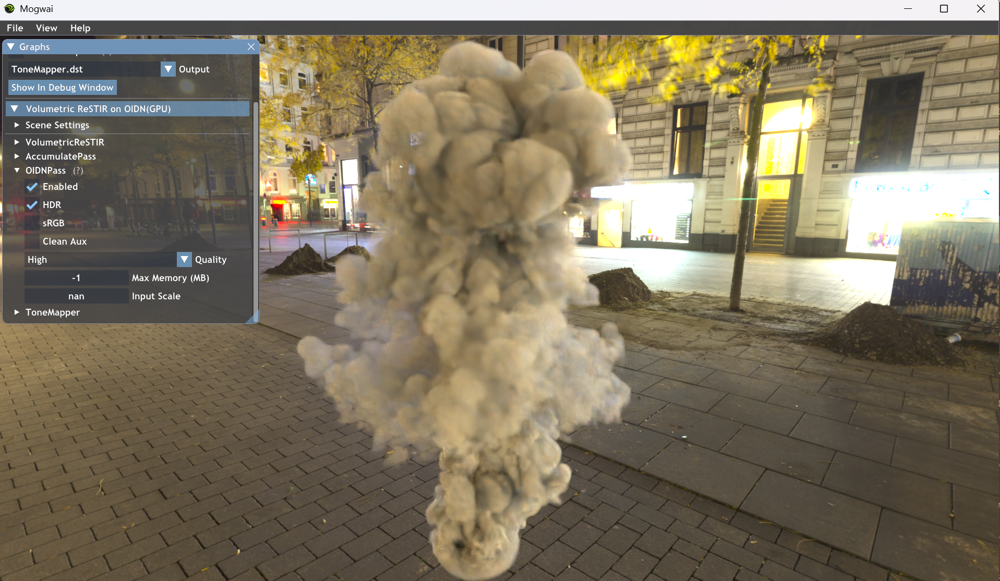
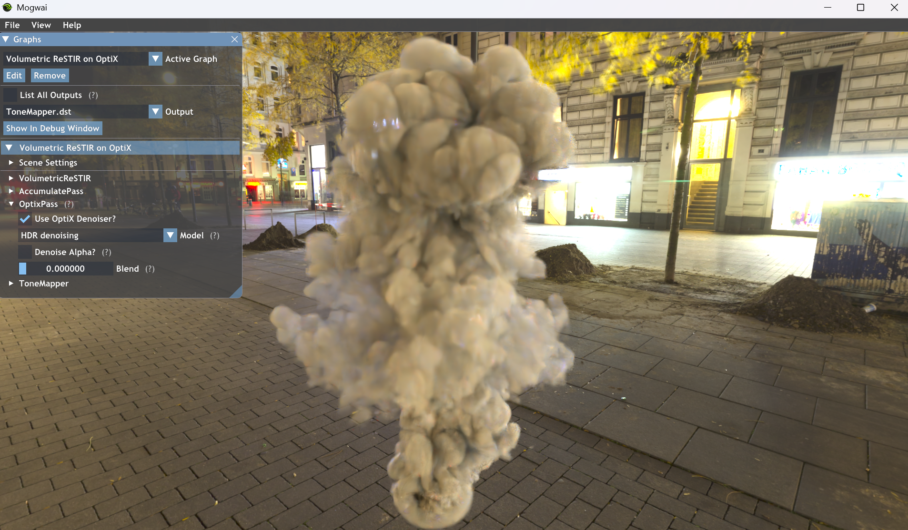

## Denoising vs Sampling Trade off for Volumetric ReSTIR

<p align="center">
  
</p>

This repository has been extended as part of an research project investigating the trade off between **denoising strength** and **additional Volumetric ReSTIR sampling** under a **fixed compute budget**.

The work builds based on the original implementation of **Volumetric ReSTIR** by Lin et al.(2021), and integrates Open Intel Image Denoise(OIDN) and the OptiX Denoiser into the Falcor pipeline to enable systematic evaluation.

The original Volumetric ReSTIR implementation can be found at:  
https://github.com/DQLin/VolumetricReSTIRRelease

> **Now ported to Falcor 8.0.** This codebase originally targeted Falcor 4.x. It has since been
> ported to **Falcor 8.0**, including the GVDB sparse-volume subsystem, the surface-scene path, the
> animated volume sequences and all three denoisers. The algorithm and shaders are preserved; the
> host/engine glue was rewritten for the 8.0 API. The original Falcor 4.x version is preserved on
> the `falcor4-legacy` branch. Detailed porting notes are in
> [`Source/RenderPasses/VolumetricReSTIR/README.md`](Source/RenderPasses/VolumetricReSTIR/README.md).

---

## Video

A video comparing Volumetric ReSTIR with different denoisers

https://github.com/user-attachments/assets/e14cf250-5386-43c5-bc7f-247b2b295c4d

## Motivation

Volumetric ReSTIR already produces low-variance samples by reusing light transport paths across space and time. In practice, however, real-time volumetric rendering pipelines often rely on denoising to further suppress noise.

This raises a key research question:

> Under a fixed frame-time budget, is it more effective to spend compute on stronger denoising, or to allocate that budget to improved Volumetric ReSTIR sampling?

To answer this, we extended the original codebase with multiple denoising configurations and performed controlled comparisons across different scenes and camera motions.

---

## Key Findings (Summary)

- Denoisers significantly reduce perceptual error, especially in complex scenes.
- In simple volumetric scenes, Volumetric ReSTIR already produces clean samples, making aggressive denoising less beneficial.
- Reallocating compute from denoising to sampling can recover much of the quality lost by weaker denoising.
- Low-quality denoising combined with improved sampling often matches and sometimes exceeds the quality of high-quality denoisers.
- Selecting the strongest denoiser is **not always optimal**; best results come from balancing sample quality and denoiser strength.

## What Was Added

### Denoiser Integrations

The following denoisers were integrated **on top of the VolumetricReSTIR render pass**:

- **Intel Open Image Denoise (OIDN) – GPU**
- **Intel Open Image Denoise (OIDN) – CPU**
- **NVIDIA OptiX AI Denoiser**
---

### Scene Configurations

Two canonical scenes were used, following the original Volumetric ReSTIR paper:

- **Simple Scene (Plume)**  
  A single volumetric plume illuminated by an environment map.  
  This setup isolates denoiser behavior in participating media without surface occlusions.

- **Complex Scene (Amazon Bistro)**  
  A geometrically dense environment populated with fog and over **20,000 emissive triangles**, introducing complex visibility, occlusion, and lighting interactions.

---

## OIDN (GPU) – Parameter Selection

The screenshot below shows the **OIDN GPU denoiser configuration** in Falcor, including the available quality presets and auxiliary input options, .etc.



---

## OptiX Denoiser – Parameter Selection

The screenshot below shows the **OptiX denoiser configuration** in Falcor, including blend factors and HDR/LDR mode, .etc.



## Scripts

All scripts used to reproduce the experiments can be found in
**[`Source/RenderPasses/VolumetricReSTIR/Scripts/`](Source/RenderPasses/VolumetricReSTIR/Scripts/)**.

| Script | Scene |
|---|---|
| `run_bunny_cloud.py` | static `bunny_cloud` volume |
| `run_plume.py` | animated `fire115` plume sequence |
| `run_multilight.py` | volume lit by multiple analytic lights |
| `run_bistro.py` | Bistro surface scene + smoke plume + many emissive lights |

To denoise, chain a denoiser between the pass and the tone mapper:
`VolumetricReSTIR.accumulated_color` → `<Denoiser>.src` → `<Denoiser>.dst` → `ToneMapper.src`
(the OptiX pass uses `color` / `output` instead of `src` / `dst`).

## Prerequisites

- **Windows 10** version 20H2 or newer
- **Visual Studio 2022**
- **Microsoft Windows SDK** 10.0.19041.0 or newer  
  https://developer.microsoft.com/en-us/windows/downloads/sdk-archive
- **NVIDIA RTX 2060** or higher

## How to Compile

Falcor 8.0 uses CMake rather than a checked-in solution:

1. Run `setup_vs2022.bat` from the repository root
2. Open the generated solution in `build/windows-vs2022`, or build from the command line with
   `cmake --build build/windows-vs2022 --config Release`
3. Binaries are written to `build/windows-vs2022/bin/Release`

## Fetch Example Scenes

Download the example scenes (**7.87 GB**) from the following link:

https://drive.google.com/file/d/1oo29EuEN4TputF6JGTJYze_e08uDRbpx/view?usp=sharing

Each run script has a `DATA_DIR` at the top — point it at the folder you extracted the scenes to.

### Baking volumes (required)

GVDB volumes must be **pre-baked** before use. The shipped `gvdb.dll` links an OpenVDB build that is
ABI-incompatible with the one Falcor 8.0 ships, so it cannot be loaded inside the Falcor process.
Instead the standalone [`GVDBBake`](Source/Tools/GVDBBake/) tool runs `gvdb.dll` in isolation and
serializes everything Falcor needs into a plain `.bin`, which the Scene loads directly:

```bat
GVDBBake.exe <vbxFolder> <numMips> <hasVelocity 0|1> <hasEmission 0|1> <out.bin>

REM examples
GVDBBake.exe "Data\bunny_cloud"   7 0 0 "Data\bunny_cloud.bin"
GVDBBake.exe "Data\smoke-plume-2" 4 0 0 "Data\smoke-plume-2.bin"
```

Place each `<name>.bin` next to its volume folder; the Scene picks it up automatically. Animated
sequences need one bake per frame.

## To Use OptiX and OIDN Denoising

The denoisers require external SDKs. Under Falcor 8.0 they are located as follows (the old
`Source\Externals\.packman` layout no longer applies):

- **CUDA** — installed system-wide and detected by CMake (tested with CUDA 12.8).
- **OptiX** — copy the SDK's `include/` folder into `external\packman\optix\`, so that
  `external\packman\optix\include\optix.h` exists (tested with **OptiX SDK 9.1.0**).
- **Intel Open Image Denoise (OIDN)** — set the `FALCOR_OIDN_DIR` CMake cache variable to your OIDN
  installation directory (tested with **OIDN v2.3.3**).

Each is gated in CMake (`FALCOR_HAS_CUDA`, `FALCOR_HAS_OPTIX`, `FALCOR_HAS_OIDN`); the project
builds without them, just without those passes.

> **Note on OptiX versions:** the SDK and the GPU driver must agree on the OptiX ABI
> (8.1 → 93, 9.0 → 105, 9.1 → 118). A driver older than the SDK fails at `optixInit()` with
> `OPTIX_ERROR_UNSUPPORTED_ABI_VERSION`. OptiX 9.1 was validated on driver 610.74.

## Credits and License

Built on **[NVIDIA Falcor](https://github.com/NVIDIAGameWorks/Falcor)** 8.0, licensed under the
BSD 3-Clause license — see [`LICENSE.md`](LICENSE.md); all upstream copyright notices are retained.
The bundled NVIDIA RTX SDKs (DLSS, RTXDI, NRD) are under their own licenses, also covered there.

- **Volumetric ReSTIR**: *Fast Volume Rendering with Spatiotemporal Reservoir Resampling*,
  Lin, Kettunen, Bitterli, Pantaleoni, Yuksel, Wyman — SIGGRAPH Asia 2021.
- Volumes use **NVIDIA GVDB Voxels**; denoising uses the **OptiX AI denoiser** and
  **[Intel Open Image Denoise](https://www.openimagedenoise.org/)**.
