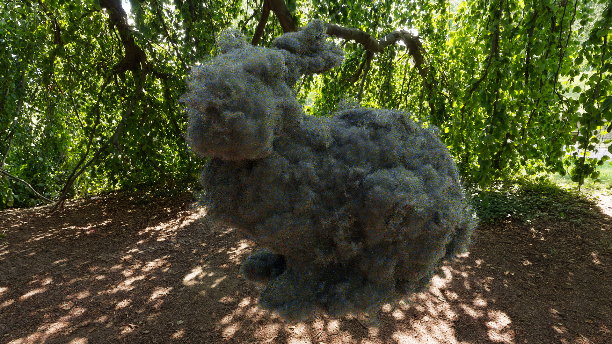

# Denoising Volumetric ReSTIR — Falcor 8.0

A port of **Volumetric ReSTIR** (Lin et al. 2021) and its denoising layer from the original
Falcor 4.x research fork to **Falcor 8.0**, together with the GVDB sparse-volume subsystem it
depends on. The algorithm and shaders are preserved; the host/engine glue was rewritten for the
Falcor 8.0 API.



## What's here

| Component | Location |
|---|---|
| Volumetric ReSTIR render pass | [`Source/RenderPasses/VolumetricReSTIR/`](Source/RenderPasses/VolumetricReSTIR/) |
| GVDB volume subsystem (in the Scene) | [`Source/Falcor/Scene/GVDB/`](Source/Falcor/Scene/GVDB/) |
| Offline GVDB bake tool | [`Source/Tools/GVDBBake/`](Source/Tools/GVDBBake/) |
| OptiX denoiser | [`Source/RenderPasses/OptixDenoiser/`](Source/RenderPasses/OptixDenoiser/) |
| Intel OIDN denoisers (CPU / GPU) | [`Source/RenderPasses/OIDNCPUPass/`](Source/RenderPasses/OIDNCPUPass/), [`Source/RenderPasses/OIDNGPUPass/`](Source/RenderPasses/OIDNGPUPass/) |
| Run scripts | [`Source/RenderPasses/VolumetricReSTIR/Scripts/`](Source/RenderPasses/VolumetricReSTIR/Scripts/) |

Detailed porting notes, gotchas and render-graph wiring are in the pass README:
[`Source/RenderPasses/VolumetricReSTIR/README.md`](Source/RenderPasses/VolumetricReSTIR/README.md).

## Status

All of the following are implemented and validated with renders on Falcor 8.0:

- **Static volumes** — `bunny_cloud`, with full temporal + spatial ReSTIR reuse.
- **Animated volume sequences** — the `fire115` plume, advancing one frame per rendered frame with
  velocity-based temporal reprojection.
- **Multi-light volumes** — a medium lit by several analytic lights.
- **Surface scenes** — Bistro: real geometry shaded and lit by its many emissive lights, with a
  smoke plume scattering that light.
- **Denoisers** — OptiX, Intel OIDN (CPU), and Intel OIDN (GPU, zero-copy CUDA interop).

## Requirements

Falcor 8.0's usual prerequisites — Windows 10 20H2 or newer, Visual Studio 2022,
[Windows 10 SDK 10.0.19041.0](https://developer.microsoft.com/en-us/windows/downloads/windows-10-sdk/),
and a DirectX Raytracing capable GPU — plus, for this project:

- **CUDA** — needed by the GPU denoisers (validated with CUDA 12.8).
- **OptiX 9.1** *(optional, for the OptiX denoiser)* — copy the SDK's `include/` into
  `external/packman/optix/` (so `external/packman/optix/include/optix.h` exists). The SDK and the
  driver must agree on the OptiX ABI, so a recent driver is required (validated on 610.74); see the
  ABI table in the pass README.
- **Intel OIDN 2.3.3** *(optional, for the OIDN denoisers)* — point the `FALCOR_OIDN_DIR` CMake
  cache variable at the SDK.

Each is gated in CMake (`FALCOR_HAS_CUDA`, `FALCOR_HAS_OPTIX`, `FALCOR_HAS_OIDN`); the project
builds without them, just without those passes.

## Building

As with Falcor: run `setup_vs2022.bat` for a Visual Studio solution (binaries in
`build/windows-vs2022/bin`), or `setup.bat` for a VS Code / CMake workflow. Presets are listed with
`cmake --list-presets`; build an existing tree with `cmake --build build/<preset>`. See
[`docs/development/cmake.md`](docs/development/cmake.md) for more.

## Scene data and baking volumes

Scene assets (`.obj`/`.fbx`, HDR environment maps and the GVDB `.vbx` volumes) are **not** part of
this repository — they are multi-GB and kept locally. Each run script has a `DATA_DIR` at the top;
edit it to point at your data folder.

GVDB volumes must be **pre-baked** first. The shipped `gvdb.dll` links an OpenVDB build that is
ABI-incompatible with the one Falcor 8.0 ships, so it cannot be loaded inside the Falcor process.
Instead the standalone [`GVDBBake`](Source/Tools/GVDBBake/) tool runs `gvdb.dll` in isolation and
serializes everything Falcor needs into a plain `.bin`, which the Scene loads directly:

```
GVDBBake.exe <vbxFolder> <numMips> <hasVelocity 0|1> <hasEmission 0|1> <out.bin>

# examples
GVDBBake.exe "Data\bunny_cloud"   7 0 0 "Data\bunny_cloud.bin"
GVDBBake.exe "Data\smoke-plume-2" 4 0 0 "Data\smoke-plume-2.bin"
```

Place each `<name>.bin` next to its volume folder; the Scene picks it up automatically. Animated
sequences need one bake per frame.

## Running

```
Mogwai.exe --script Source/RenderPasses/VolumetricReSTIR/Scripts/run_bunny_cloud.py
```

| Script | Scene |
|---|---|
| `run_bunny_cloud.py` | static `bunny_cloud` volume |
| `run_plume.py` | animated `fire115` plume sequence |
| `run_multilight.py` | volume lit by multiple analytic lights |
| `run_bistro.py` | Bistro surface scene + smoke plume + many emissive lights |

To denoise, chain a denoiser between the pass and the tone mapper:
`VolumetricReSTIR.accumulated_color` → `<Denoiser>.src` → `<Denoiser>.dst` → `ToneMapper.src`
(the OptiX pass uses `color` / `output` instead of `src` / `dst`).

## Credits and license

This project is built on **[NVIDIA Falcor](https://github.com/NVIDIAGameWorks/Falcor)** 8.0, which is
licensed under the BSD 3-Clause license — see [`LICENSE.md`](LICENSE.md). All Falcor copyright
notices are retained. Note that the bundled NVIDIA RTX SDKs (DLSS, RTXDI, NRD) are under their own
licenses, also covered in `LICENSE.md`.

- **Volumetric ReSTIR**: *Fast Volume Rendering with Spatiotemporal Reservoir Resampling*,
  Lin, Kettunen, Bitterli, Pantaleoni, Yuksel, Wyman — SIGGRAPH Asia 2021.
- Volumes use **NVIDIA GVDB Voxels**; denoising uses the **OptiX AI denoiser** and
  **[Intel Open Image Denoise](https://www.openimagedenoise.org/)**.

If you use Falcor itself in a research project leading to a publication, please cite it:

```bibtex
@Misc{Kallweit22,
   author =      {Simon Kallweit and Petrik Clarberg and Craig Kolb and Tom{'a}{\v s} Davidovi{\v c} and Kai-Hwa Yao and Theresa Foley and Yong He and Lifan Wu and Lucy Chen and Tomas Akenine-M{\"o}ller and Chris Wyman and Cyril Crassin and Nir Benty},
   title =       {The {Falcor} Rendering Framework},
   year =        {2022},
   month =       {8},
   url =         {https://github.com/NVIDIAGameWorks/Falcor},
   note =        {\url{https://github.com/NVIDIAGameWorks/Falcor}}
}
```

The original Falcor 4.x fork this was ported from is preserved on the `falcor4-legacy` branch.
